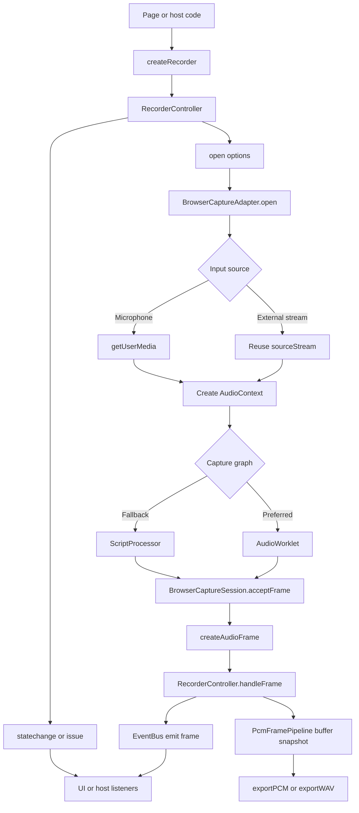

# audio-recorder

面向 `Recorder` 长期 TypeScript 重构的 Phase 3 录音、导出与扩展核心链路。

## Commands

- `npm run dev`
- `npm run dev:playground`
- `npm run build`
- `npm run typecheck`
- `npm run test:unit`
- `npm run test:functional`
- `npm run test:functional:headed`
- `npm run check`

## Status

- Current phase: `Phase 3`
- Long-term plan: [`docs/plans/recorder-ts-master-plan.md`](./docs/plans/recorder-ts-master-plan.md)
- Documentation index: [`docs/README.md`](./docs/README.md)

## Implemented

- Typed `RecorderController` lifecycle: `open / start / pause / resume / stop / close / destroy`
- Browser capture adapter with microphone or external `MediaStream` input
- Real-time PCM frame dispatch with actual sample rate and channel count feedback
- State change and issue events for runtime control, with warnings logged directly and issues broadcast through the event bus
- Browser capture prefers `AudioWorklet`, and only falls back to deprecated `ScriptProcessor` when runtime capability is insufficient
- Capture-layer unit tests cover adapter source selection plus both `AudioWorklet` and `ScriptProcessor` graph branches
- Playground is detached from source code and consumes the built library artifact at `dist/index.js`
- Internal `buffer + pipeline` chain accumulates planar PCM snapshots for export
- Snapshot merge now caches inside the buffer store, so repeated exports do not re-merge all PCM chunks every time
- Buffer store now keeps only the minimum `appendFrame / snapshot / clear` interface; layout mismatch checks remain only as a guard against mixed-session or mixed-layout frame pollution
- Built-in `exportPCM()` and `exportWAV()` support mono/stereo output, optional resample, and `bitRate: 8 | 16`
- WAV export reuses PCM export results and writes standard PCM WAV headers without introducing an extra realtime encoder layer
- `RecorderController` now exposes `registerEncoder()` and generic `exportEncoded()`, so custom snapshot encoders can be registered without reaching into internal registry state
- Built-in PCM/WAV encoders are now available as explicit subpath modules:
  - `@scope/audio-recorder/encoders/pcm`
  - `@scope/audio-recorder/encoders/wav`
- Storage spill is now modeled as an optional capability interface: the core library only knows the persistence contract, while OPFS and IndexedDB are pluggable implementations you opt into explicitly
- Storage mode now follows three explicit behaviors:
  - `memory`: stay in memory only
  - `persistent`: start with persistence immediately
  - `auto`: remain in memory until `memoryThresholdBytes` is exceeded, then activate persistence
- Whether `persistent` or `auto` can really use durable storage still depends on whether a persistence plugin was provided; otherwise the recorder warns and continues in memory
- Optional persistence plugins are consumed through dedicated subpath entries, not the root entry:
  - `@scope/audio-recorder/storage/opfs`
  - `@scope/audio-recorder/storage/indexeddb`
- The core spill buffer defaults to `256 * 1024` bytes per persisted chunk; the playground follows the same order of magnitude instead of using tiny diagnostic-only chunks

## Phase 2 Direction

- Phase 2 will keep the refactor plan as the primary constraint and use `vendor/Recorder-master` only as capability reference, not as a line-by-line implementation target.
- Export options may expose a unified `bitRate` field, but internal semantics will stay split by format:
  - `pcm/wav`: normalize to `bitsPerSample`
  - `mp3` and other compressed formats: normalize to `bitRateKbps`
- The first Phase 2 implementation step is `buffer + pipeline`, before resample and PCM/WAV exporters.
- The second Phase 2 implementation step is `snapshot -> resample -> interleaved PCM export`, while WAV remains a thin wrapper for the next step.
- The third Phase 2 implementation step is complete: `wav header + wav export`, and the controller now exposes `exportPCM()` / `exportWAV()`.
- Long-record protection now follows a plugin-shaped storage contract: default is memory-only, while OPFS / IndexedDB persistence is opt-in and lifecycle-bound to the current recording session.

## Phase 3 Direction

- Built-in plugin lifecycle is now part of the controller runtime.
- Encoder registration is no longer only an internal implementation detail; custom encoders can now be registered through the public controller API.
- Built-in encoders follow the same subpath export strategy as plugins and persistence modules, keeping the root entry focused on the smallest default surface.
- Current root API does not yet position custom plugin authoring as a supported external integration surface; only built-in plugin paths are kept stable for now.

## Execution chain

状态机主链路：`idle -> ready -> recording -> paused -> recording -> stopped -> closed`。  
完整文字版链路见 [`docs/architecture/execution-chain.md`](./docs/architecture/execution-chain.md)。

## Demo surfaces

- Root page: static landing page that only links to the playground
- `/playground/`: Vue CDN demo that imports `dist/index.js` and covers microphone plus external stream scenarios
- Built-in encoder subpaths live at `/dist/encoders/pcm/index.js` and `/dist/encoders/wav/index.js`
- Persistence demo paths in the playground import `/dist/storage/opfs/index.js` and `/dist/storage/indexeddb/index.js` directly, instead of relying on the root artifact to re-export them

`npm run dev:playground` will build the library first, because the playground intentionally depends on the packaged output instead of `src`.

## Upstream baseline

- Upstream Recorder source is vendored at `vendor/Recorder-master`
- Future feature work should compare behavior against upstream code and demos, not only against [`docs/plans/recorder-ts-master-plan.md`](./docs/plans/recorder-ts-master-plan.md)
