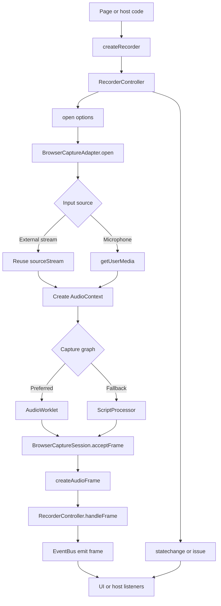

# audio-recorder

面向 `Recorder` 长期 TypeScript 重构的 Phase 1 录音核心链路。

## Commands

- `npm run dev`
- `npm run dev:playground`
- `npm run build`
- `npm run typecheck`
- `npm run test:unit`
- `npm run test:functional`
- `npm run test:functional:headed`
- `npm run check`

## Status

- Current phase: `Phase 1`
- Long-term plan: [`docs/plans/recorder-ts-master-plan.md`](./docs/plans/recorder-ts-master-plan.md)
- Documentation index: [`docs/README.md`](./docs/README.md)

## Implemented in Phase 1

- Typed `RecorderController` lifecycle: `open / start / pause / resume / stop / close / destroy`
- Browser capture adapter with microphone or external `MediaStream` input
- Real-time PCM frame dispatch with actual sample rate and channel count feedback
- State change and issue events for runtime control, with warnings logged directly and issues broadcast through the event bus
- Browser capture prefers `AudioWorklet`, and only falls back to deprecated `ScriptProcessor` when runtime capability is insufficient
- Capture-layer unit tests cover adapter source selection plus both `AudioWorklet` and `ScriptProcessor` graph branches
- Playground is detached from source code and consumes the built library artifact at `dist/index.js`

## Execution chain

状态机主链路：`idle -> ready -> recording -> paused -> recording -> stopped -> closed`。  
完整文字版链路见 [`docs/architecture/execution-chain.md`](./docs/architecture/execution-chain.md)。

## Demo surfaces

- Root page: static landing page that only links to the playground
- `/playground/`: Vue CDN demo that imports `dist/index.js` and covers microphone plus external stream scenarios

`npm run dev:playground` will build the library first, because the playground intentionally depends on the packaged output instead of `src`.

## Upstream baseline

- Upstream Recorder source is vendored at `vendor/Recorder-master`
- Future feature work should compare behavior against upstream code and demos, not only against [`docs/plans/recorder-ts-master-plan.md`](./docs/plans/recorder-ts-master-plan.md)
