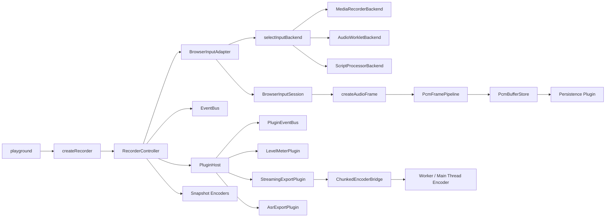
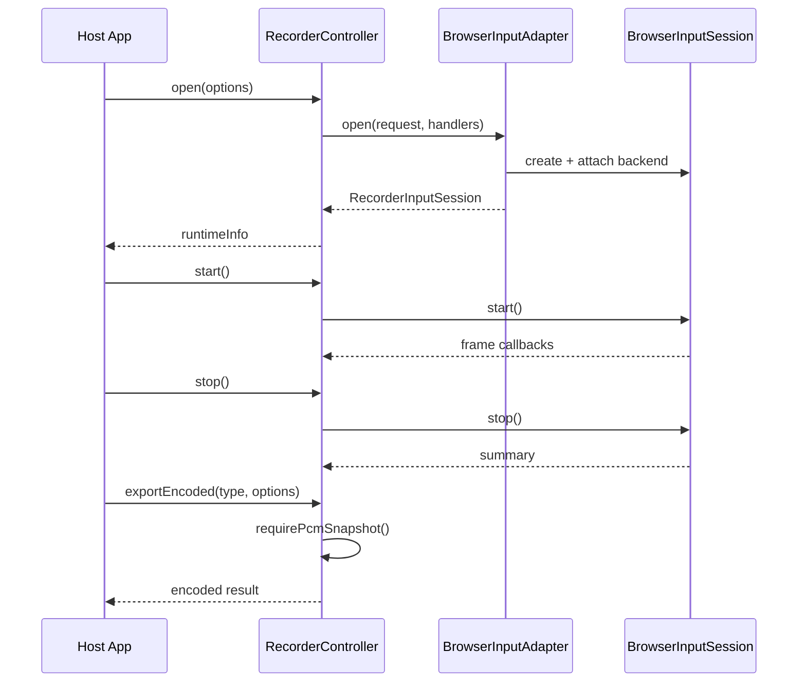
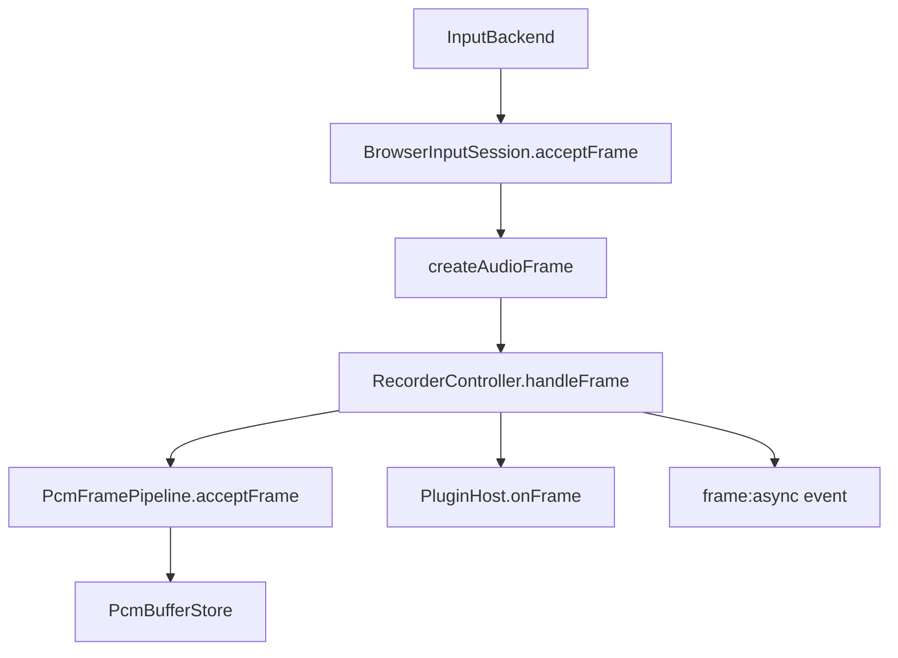
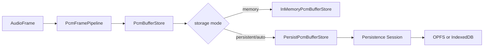
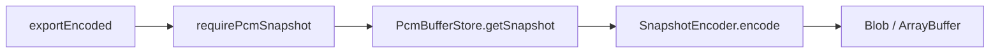
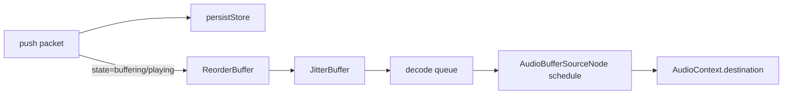

# Audio Recorder Execution Chain

本文档描述当前仓库已经落地的执行链路，对应 `src/` 下真实实现，而不是未来规划中的理想形态。

相关文档：

- 总索引：[`docs/README.md`](../README.md)
- Streaming Player 设计方案：[`docs/plans/recorder-ts-master-plan.md`](../plans/recorder-ts-master-plan.md) 中的 `6.2 流播放器插件（StreamingPlayer）`

---

## 0. 总览

当前架构可以概括为五层：

1. 控制层：`RecorderController` 负责生命周期、状态机、事件分发、编码器注册和插件宿主。
2. 输入层：`BrowserInputAdapter` 负责取流、选择输入后端，并把原始音频帧交给 `BrowserInputSession`。
3. 缓冲与导出层：`PcmFramePipeline + PcmBufferStore` 负责积累 PCM 快照，编码器负责全量导出或实时分片编码。
4. 插件层：Level Meter、StreamingExport、ASR Export 等插件通过 `PluginHost` 接入，以 `plugin:` 前缀事件对外输出。
5. 扩展层：持久化后端、Worker bridge 通过显式子路径接入，不污染根入口。

## 1. 模块职责图



## 2. 主入口链路

对外入口在 [`src/index.ts`](/E:/ai-base-workspace/audio-recorder/src/index.ts)。

- `createRecorder(options)` 创建 `RecorderController`
- `options` 由三部分组成：
  - 录音输入默认值，如 `sampleRate`、`channelCount`、`deviceId`、`inputStrategy`
  - `storage`：缓冲与持久化策略
  - `encoders`：供 `exportEncoded()` 使用的快照编码器定义
- 根入口同时导出：
  - `listMicrophoneDevices()`
  - `checkRecorderCapability()`
  - 核心类型、状态枚举、工具函数

根入口不自动注册编码器。`exportEncoded("pcm" | "wav" | "mp3")` 是否可用，取决于调用方是否显式传入相应编码器定义。

## 3. RecorderController 链路

控制器实现位于 [`src/core/recorder-controller.ts`](/E:/ai-base-workspace/audio-recorder/src/core/recorder-controller.ts)。

核心职责：

- 维护状态机：`idle -> ready -> recording -> paused -> stopped -> closed -> destroyed`
- 管理当前输入会话 `RecorderInputSession`
- 持有 `PcmFramePipeline`
- 持有编码器注册表 `Map<string, ExportEncoderDefinition>`
- 持有 `PluginHost`
- 对外暴露统一事件入口 `on/off`

主生命周期：



几个关键点：

- `open()` 会先重置旧 pipeline，再为新 session 创建新的 buffer store
- `start()` 时缓存是否存在 `frame:async` 监听器，减少热路径开销
- `handleFrame()` 同时推进三条链：
  - 写入 `framePipeline`
  - 更新 `runtimeInfo` 与 `summary`
  - 通知 `PluginHost`
- `issue` 事件会统一通过 `handleIssue()` 发出，warning 同时写 `console.warn`

## 4. 参数合并链路

参数优先级分两层：

1. `createRecorder()` 保存默认输入参数
2. `open()` 传入的字段覆盖默认值

因此真实输入配置来源于：

```ts
const mergedInput = {
  ...defaultInput,
  ...openOptions,
}
```

存储配置与编码器列表只在 `createRecorder()` 时注入，不在 `open()` 阶段动态变更。

## 5. 浏览器输入链路

输入适配器位于 [`src/input/browser-input-adapter.ts`](/E:/ai-base-workspace/audio-recorder/src/input/browser-input-adapter.ts)。

执行顺序：

1. 读取 `RecorderInputOptions`
2. 如果调用方未传 `sourceStream`，则通过 `acquireMicStream()` 获取麦克风流
3. 对自有麦克风流执行约束诊断 `reportUnappliedConstraints()`
4. 用 `track.getSettings().channelCount` 读取实际声道数
5. 创建 `AudioContext`
6. 创建 `BrowserInputSession`
7. 调用 `selectInputBackend()` 选择实际采集后端
8. 通过 `session.attachBackend(backend)` 完成显式装配

这里的设计重点是：

- `BrowserInputAdapter` 只负责装配，不负责状态机
- `BrowserInputSession` 作为 `sink` 接收后端推送的原始帧
- 后端选择失败时会主动关闭 `AudioContext`，防止泄漏

## 6. 输入后端选择与降级

后端编排位于 [`src/input/backends/select.ts`](/E:/ai-base-workspace/audio-recorder/src/input/backends/select.ts)。

当前支持三种底层采集策略：

- `media-recorder`
- `audio-worklet`
- `script-processor`

默认优先级：

```text
media-recorder -> audio-worklet -> script-processor
```

策略规则：

- `inputStrategy: "auto"` 按标准优先级尝试
- 显式指定某个策略时，会优先尝试该策略；失败后仍继续按剩余标准优先级降级
- 对非最后一个候选失败，会发出降级 warning
- 全部失败时直接抛错

当前 warning 映射：

- `media-recorder` 不可用时发 `MediaRecorderFallback`
- `audio-worklet` 不可用时发 `ScriptProcessorFallback`

## 7. 三种输入后端的职责边界

### 7.1 MediaRecorderBackend

实现位于 [`src/input/backends/media-recorder-backend.ts`](/E:/ai-base-workspace/audio-recorder/src/input/backends/media-recorder-backend.ts)。

特点：

- 直接消费 `MediaStream`
- 使用 `audio/webm; codecs=pcm`
- 产出 WebM PCM 数据后再交给 `webm-pcm-extractor` 解析为 planar PCM
- 保留浏览器原生 APM 链路

适合浏览器原生支持较好的路径，因此被放在默认优先级第一位。

### 7.2 AudioWorkletBackend

实现位于 [`src/input/backends/audio-worklet-backend.ts`](/E:/ai-base-workspace/audio-recorder/src/input/backends/audio-worklet-backend.ts)。

特点：

- 基于 Web Audio 图构建
- 通过 `AudioWorkletNode` 把 PCM 帧回传到 session
- 移动端启用批量缓冲，降低消息频率
- 当浏览器支持良好时，适合作为 MediaRecorder 之后的高质量降级路径

### 7.3 ScriptProcessorBackend

实现位于 [`src/input/backends/script-processor-backend.ts`](/E:/ai-base-workspace/audio-recorder/src/input/backends/script-processor-backend.ts)。

特点：

- 仅作兼容性兜底
- 依赖废弃的 `ScriptProcessorNode`
- 仍通过 `sink` 和 session 走统一帧处理链路

文档与代码都将其视为 fallback，而不是推荐主路径。

## 8. BrowserInputSession 与帧生成

`BrowserInputSession` 位于 [`src/input/browser-input-session.ts`](/E:/ai-base-workspace/audio-recorder/src/input/browser-input-session.ts)。

它是输入层和控制层之间的桥：

- 负责录音态门控
- 负责把 Float32 planar 帧转换成 `AudioFrame`
- 负责丢帧补偿与 frame loss warning（可通过 `disableFrameLossCompensation: true` 禁用静音填补，但 warning 仍会触发）
- 对外提供：
  - `actualSampleRate`
  - `actualChannelCount`
  - `actualInputStrategy`
  - `start / pause / resume / stop / close`

帧对象结构定义在 [`src/types.ts`](/E:/ai-base-workspace/audio-recorder/src/types.ts)：

```ts
interface AudioFrame {
  channels: number
  sampleRate: number
  timestamp: number
  durationMs: number
  planar: Int16Array[]
}
```

## 9. 帧流转链路

帧链路从输入后端进入，到导出或插件消费结束：



其中：

- `PcmFramePipeline` 位于 [`src/pipeline/pcm-frame-pipeline.ts`](/E:/ai-base-workspace/audio-recorder/src/pipeline/pcm-frame-pipeline.ts)
- 真实缓冲实现位于 `src/buffer/`
- `frame:async` 只在存在监听器时才异步派发

## 10. 缓冲与持久化链路

缓冲层支持三种模式：

- `memory`
- `persistent`
- `auto`

接口定义位于 [`src/storage/types.ts`](/E:/ai-base-workspace/audio-recorder/src/storage/types.ts)。

设计原则：

- 核心库只认识持久化协议，不内置具体后端
- OPFS 和 IndexedDB 通过独立子路径插件接入
- `auto` 模式在内存超过阈值后再切换持久化

当前可用持久化插件：

- `audio-recorder/storage/opfs`
- `audio-recorder/storage/indexeddb`

持久化链路如下：



## 11. 事件架构

当前事件分成两类总线：

1. 主控制器事件总线 `EventBus`
2. 插件事件总线 `PluginEventBus`

主事件包括：

- `statechange`
- `frame:async`
- `issue`

插件事件以 `plugin:` 为前缀，例如：

- `plugin:level` — 音量电平
- `plugin:stream` — 实时流式数据包（StreamingExportPlugin 产出）
- `plugin:asr` — ASR 导出数据包（AsrExportPlugin 产出）

`RecorderController.on()` 会根据事件名前缀决定路由到哪条总线。

## 12. 插件链路

插件宿主位于 [`src/plugins/plugin-host.ts`](/E:/ai-base-workspace/audio-recorder/src/plugins/plugin-host.ts)。

当前内置且稳定的插件能力有三个：

### 12.1 Level Meter

入口：[`src/plugins/level-meter/index.ts`](/E:/ai-base-workspace/audio-recorder/src/plugins/level-meter/index.ts)

功能：

- 在 `onFrame()` 中计算峰值和 RMS
- 通过 `plugin:level` 向外发事件
- 不修改主链路数据

### 12.2 Streaming Export

入口：[`src/plugins/streaming-export/index.ts`](/E:/ai-base-workspace/audio-recorder/src/plugins/streaming-export/index.ts)

功能：

- 接收实时 PCM 帧
- 通过 `ChunkedEncoderBridge` 驱动 chunk 编码
- 优先走 Worker，失败时可降级回主线程
- 在 `start()` 时重置 bridge，并为本次录音生成新的 stream session
- 通过 `plugin:stream` 输出 `StreamingPacketPayload`
- `stop()` 时通过 `flush()` 补发最终 packet（若编码器仍有剩余输出）

输出包类型（`StreamingPacketPayload`）：

```ts
interface StreamingPacketPayload {
  streamId: string // 逻辑流 ID，跨重连可稳定
  sessionId: string // 本次录音会话 ID
  seq: number // 顺序号
  timestampMs: number // 帧时间戳
  durationMs: number // 本 chunk 时长
  sampleRate: number
  channels: number
  format: string
  chunk: Uint8Array // 编码后的音频数据
  isFinal: boolean // 是否为 session 最后一个 packet
  discontinuity?: boolean // 是否存在不连续片段
  metadata?: Record<string, unknown>
}
```

### 12.3 ASR Export

入口：[`src/plugins/asr-export/index.ts`](/E:/ai-base-workspace/audio-recorder/src/plugins/asr-export/index.ts)

功能：

- 专为 ASR（语音识别）场景设计
- 支持独立采样率设置（通常 16kHz）
- 支持自定义分块时长 `chunkDurationMs`
- 通过 `plugin:asr` 输出数据包

## 13. ChunkedEncoderBridge

位于 [
`src/plugins/chunked-encoder-bridge.ts`](/E:/ai-base-workspace/audio-recorder/src/plugins/chunked-encoder-bridge.ts)。

这是 StreamingExport 和 ASR Export 的共享实现核心，负责：

- 在 Worker 和主线程之间透明地调度编码任务
- 维护 `sequenceIndex` 和时间戳
- 管理 Worker 生命周期和降级逻辑

## 14. 导出链路

当前同时存在两类导出路径。

### 14.1 全量快照导出

入口：`recorder.exportEncoded(type, options?)`

链路：



特点：

- 同步阻塞整段数据
- 支持 WAV、PCM、MP3、G711、Opus、FLAC、AAC、AMR
- 编码器由调用方显式注入

### 14.2 实时流式导出

通过 `StreamingExportPlugin` 实现（见 12.2 节）。

### 14.3 流式播放

`streaming-player` 是独立于录音主链路的消费端，入口位于
[`src/plugins/streaming-player/player.ts`](/E:/ai-base-workspace/audio-recorder/src/plugins/streaming-player/player.ts)。

当前落地行为：

- `push(packet)` 始终双写到 `persistStore`
- `idle / paused` 时只保留历史，不进入实时播放管线
- `start()` 采用 **live-edge start**：先清空旧播放积压，再从 `persistStore.recent(targetLatencyMs)` 回灌最近一个小窗口作为启动垫片
- `resume()` 也会清空旧 live backlog，从新的 live 数据重新缓冲
- `maxBufferMs` 约束的是 `ReorderBuffer + JitterBuffer` 的总 live 积压，而不是单个子缓冲
- `persistMode: "custom"` 时不会自动创建 store，必须先通过 `player.use(store)` 注册外部 `PersistStore`

链路如下：



几个设计点：

- `persistStore` 负责历史重播和启动垫片，不承担实时播放调度。
- 内置 `memory / indexeddb` store 仍受 `persistBufferMs` 控制；custom store 的保留和淘汰策略完全由调用方实现控制。
- `bufferedMs` 表示整条播放管线的总余量：`reorder + jitter + pending decode + scheduled audio`。
- `onPacketDrop` 表示 live 管线真实过载；如果只是长期未 `start()`，不会再因为历史 backlog 误触发 drop。

## 15. 子路径导出结构

```text
@csnight/audio-recorder               — 核心控制器、类型、工具
@csnight/audio-recorder/codecs/base   — WAV / PCM 编码器
@csnight/audio-recorder/codecs/mp3    — MP3 编码器（WASM）
@csnight/audio-recorder/codecs/g711   — G711 编码器
@csnight/audio-recorder/codecs/opus   — Opus/OGG/WebM 编码器（WASM）
@csnight/audio-recorder/codecs/flac   — FLAC 编码器（WASM）
@csnight/audio-recorder/codecs/aac    — AAC 编码器（WASM）
@csnight/audio-recorder/codecs/amr    — AMR-NB/WB 编码器（WASM）
@csnight/audio-recorder/plugins/level-meter       — 音量插件
@csnight/audio-recorder/plugins/streaming-export  — 实时流导出插件
@csnight/audio-recorder/plugins/asr-export        — ASR 导出插件
@csnight/audio-recorder/storage/opfs              — OPFS 持久化后端
@csnight/audio-recorder/storage/indexeddb         — IndexedDB 持久化后端
```

## 16. Playground

Playground 位于 `playground/`，是独立 Vite + Vue 3 应用。

当前 playground 依赖 `dist/` 编译产物（而非 npm 包），通过 vite alias 将所有
`@csnight/audio-recorder` 路径映射到 `../dist`。

这使 playground 成为库本身的直接集成测试环境：

- 每次 `npm run build` 后刷新 playground 即可验证导出
- 不需要发布到 npm 再验证

## 17. 测试结构

```text
tests/
  unit/          — Vitest 单元测试（encoder、plugin 行为）
  functional/    — Playwright 功能测试（浏览器环境真实录音链路）
```

Playwright 测试依赖 Vite 开发服务器，通过真实浏览器环境验证采集、编码和导出链路。
